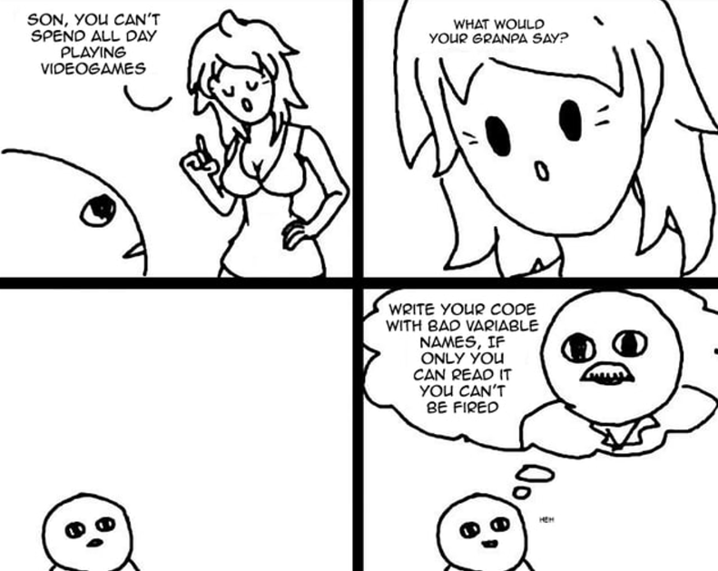

# Les 10 commandements du clean code

### Pourquoi faire du clean code

Quels sont les caractéristiques d’un mauvais code : 

- Un code pourri
- La rigidité
- La fragilité
- Inséparabilité (le fait que du code ne peut pas être séparé et réutilisé ailleurs)
- L’opacité (difficile à lire)
- En voulant aller trop vite (les deadlines pour hier)

Les avantages d’écrire le code proprement :

- Qualité du code
- Lisibilité
- Facilité de maintenance
- Pour se la péter

### 1. Nommage des variables

- Les “règles d’écriture” :
    - le camelCase pour les variables et fonctions.
    - le SNAKE_UPPER_CASE pour les constantes.
- Un nom significatif :
    
    Privilégier toujours un nom de variable significatif plutôt qu’une variable x ou y. Le but est de donner un nom qui exprime le sens de notre objectif. Par exemple : “getUserInfo” ou “getUserBankInfo”
    
- Privilégier un détail plutôt qu’un résumé : même principe que précédemment. En utilisant un nombre plus précis, cela évite que l’on se retrouve avec des “doublons” lorsque deux fonctionnalités se ressemble. Par exemple :
    
    ```jsx
    let searchUser = (phone) => {
    	//do something
    }
    
    //ou 
    
    let searchUserByPhoneNo = (phone) => {
    	//do something
    }
    ```
    
- Utiliser des verbes cohérents : “create”, “get”, “update”
- “The Scope Length Rule” → on peut utiliser des noms de variables courts lorsque le scope est petit, mais il est préférable d’utiliser des noms de variables précis lorsque le scope est plus grand voir global. Oui la taille compte.

### 2. Les nombres magiques :

Un nombre magique signifie que nous attribuons un nombre sans signification claire. Parfois, nous utilisons une valeur dans un but précis, cependant nous ne l’affectons pas à une variable significative. Le problème est que lorsque quelqu’un travaille avec votre code, il ne connaît pas la signification de cette valeur directe.

```jsx
const NUMBER_OF_STUDENTS = 50{
for(let i= 0; i<NUMBER_OF_STUDENTS; i++){
	//do something
}

// ou 

for(let i= 0; i<50; i++){
	//do something
}
```

### 3. Les imbrications biscornues

Parfois, on se intègre des éléments qui sont compliqués à comprendre. 

Supposons qu’on a un tableau dans un tableau lui-même dans un tableau :

```jsx
const ARRAY = [[['une plume']]]
array.forEach((firstArray) =>{
	firstArray.forEach((secondArray) =>{
		secondArray.forEach(element) =>{
			console.log(element);
		})
	})
})

//ou

const getValuesOfNestedArray = (element) => {
	if(Array.isArray(element)){
		return getValuesOfNestedArray(element[0])
	}
	return element
}
getValuesOfNestedArray(ARRAY)
```

### 4. Les Commentaires

Cela permet d’aider les gens à mieux comprendre le code plus tard dans le temps, à mieux collaborer sur le même projet. 

### 5. Eviter les trop grandes fonctions

Un adage en dev est : “Diviser pour mieux régner”. 

On m’a également dit : “Si ta fonction fait plus de 30 lignes, c’est que tu peux la séparer en plusieurs petites fonctions”. 

En divisant nos fonctions, cela nous permet de pouvoir les réutiliser plus tard et d’avoir un code plus lisible.

```jsx
let addSub = (a, b) => {
	let addition = a + b
	let sub = a - b
	return `${addition}${sub}`
	
//ou

let add = (a, b) => {
	return a + b
}
let sub = (a, b) => {
	return a - b
}
```

### 6. DRY

“Don’t Repeat Yourself”

Pour ceux qui parle pas anglais : Ne te répète pas ! En fait, dès qu’on se répète dans le code, cela signifie que l’on peut créer une fonction pour ce bout de code. 

### 7. KISS

“Keep It Simple, Stupid”

Le but ici c’est de rappeler qu’il faut construire notre code de la manière la plus simple possible. Cela ne sert à rien de construire notre code de façon complexe. 

### 8. YAGNI

“You Aren’t Gonna Need It”

Ce principe exprime l’idée suivante : il faut uniquement ajouter des fonctionnalités supplémentaires au code lorsqu’elles sont nécessaires. Ce principe est étroitement lié aux méthodes de dev agile. 

### 9. SOLID

- **Responsabilité unique (*Single responsibility principle*)**
    
    Une classe, une fonction ou une méthode doit avoir une et une seule unique raison d'être modifiée. Cela favorise la modularité et facilite la maintenance en évitant les classes surchargées de responsabilités.
    
- **Ouvert/fermé (*Open/closed principle*)**
    
    Une entité applicative (classe, fonction, module ...) doit être fermée à la modification directe mais ouverte à l'extension. L'objectif est de permettre l'ajout de nouvelles fonctionnalités sans altérer le code existant.
    
- **Substitution de Liskov (*Liskov substitution principle*)**
    
    Une instance de type T doit pouvoir être remplacée par une instance de type G, tel que G sous-type de T, sans que cela ne modifie la cohérence du programme. Cela garantit que les sous-classes peuvent être utilisées de manière interchangeable avec leurs classes de base.
    
- **Ségrégation des interfaces (*Interface segregation principle*)**
    
    Préférer plusieurs interfaces spécifiques pour chaque client plutôt qu'une seule interface générale. Cela évite aux classes de dépendre de méthodes dont elles n'ont pas besoin, réduisant ainsi les couplages inutiles.
    
- **Inversion des dépendances (*Dependency inversion principle*)**
    
    Il faut dépendre des abstractions, pas des implémentations. Cela favorise la modularité, la flexibilité et la réutilisabilité en réduisant les dépendances directes entre les modules.
    

### 10. Petit tips



### Conclusion

En respectant ces bonnes pratiques, cela permet d’améliorer la lisibilité, la maintenance et favoriser la collaboration

L’application de ces pratiques vous évitera d’avoir un code spaghetti et de passer pour un noob. 

Mais rassurez vous, on est tous des noobs a l’heure actuelle et c’est en forgeant qu’on devient un bon codeur. Donc forgez !

Source : 

- https://www.ionos.fr/digitalguide/sites-internet/developpement-web/clean-code-avantages-principes-et-exemples/
- https://www.contraste.com/fr/blog/clean-code-quels-avantages-pour-vos-projets-et-lefficacite-des-developpeurs
- https://dev.to/omarkhatib/001-clean-code-clean-code-47jo
- https://www.all4test.fr/blog-du-testeur/12-regles-pour-faire-du-clean-code/